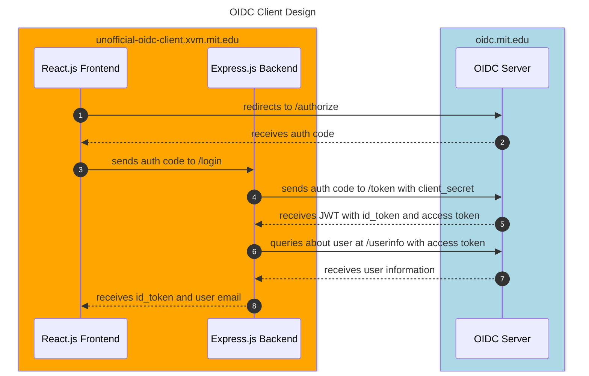

# mit-oidc-client

Unofficial client template for Petrock OpenID Connect (OIDC) service

Live example can be found at: <https://unofficial-oidc-client.xvm.mit.edu>

A short presentation summarizing our project can be found [here](https://docs.google.com/presentation/d/1_L9uNqXT8jQCf2XUvjioHke7KBq4loDDfeWcYvIzTNI/edit?usp=sharing).

## Table of Content

- [mit-oidc-client](#mit-oidc-client)
  - [Table of Content](#table-of-content)
  - [Goal](#goal)
  - [What is included?](#what-is-included)
  - [Background](#background)
    - [What is OpenID Connect?](#what-is-openid-connect)
  - [How does it work?](#how-does-it-work)
  - [Related Works](#related-works)
  - [Security Design](#security-design)
  - [Developer Information](#developer-information)
  - [Requirements](#requirements)
    - [Setup](#setup)
    - [Running Code](#running-code)
    - [First step: OIDC registration + edit auth configs](#first-step-oidc-registration--edit-auth-configs)
  - [Second Step: Sessions](#second-step-sessions)
    - [Third step: Nginx](#third-step-nginx)
    - [Fourth step: Certificates](#fourth-step-certificates)
    - [Note about Hosting Options:](#note-about-hosting-options)
  - [Optional Reading: How our code works](#optional-reading-how-our-code-works)
    - [System Diagram](#system-diagram)
    - [Frontend](#frontend)
    - [Backend](#backend)
  - [Future Works](#future-works)
    - [Extension: OpenPubKey](#extension-openpubkey)
    - [Example Application: Authenticated Chatroom](#example-application-authenticated-chatroom)
      - [Other possible OpenPubKey usage](#other-possible-openpubkey-usage)
  - [Questions/ Feature Requests?](#questions-feature-requests)


## Goal

We want to provide an easy-to-use template for MIT students looking to develop secure web services that supports MIT Touchstone authentication.

While [supporting documentation](https://ist.mit.edu/oidc) exists to do user authentication using [Petrock OpenID Connect](https://oidc.mit.edu/) service, we feel there is a knowledge gap and technical barrier that prevents its widespread adoption. In this project, we hope to provide a simple and secure client implementation that MIT student developers can adopt to quickly get authentication in their web services.

## What is included? 

- Basic template for a **secure web service** containing front-end (React.js) and API back-end (Express.js)
- Features for **integration with Touchstone authentication** via Petrock OpenID Connect (OIDC) service
  - Includes code for securely requesting, parsing, and validating OAuth tokens from MIT OIDC
  - Provides logic for how to use those tokens to request information about users
- [**Support developer documentation**](#developer-information) for how to use our template and how OpenID Connect works
- **Implementation of OpenPubKey**, which is a client-side extension that extends the OIDC protcol and adds to its security by allowing for secure signing and verification of messages.
  - As an example usage, we provide a **simple chatroom service** (in /frontend/src/chatroom and /backend/src/chatroom) that uses this feature. Users can verify the signature of messages to check if they actually came from the declared user.

## Background

### What is OpenID Connect?

OpenID Connect is an authentication protocal that builds on top of OAuth2.0. OIDC provides a secure and easy-to-use way for web applications to authenticate users via a Single-Sign-On (SSO) service like Google accounts or MIT Touchstone. 

## How does it work?

A helpful illustrative guide can be found [here](https://developer.okta.com/blog/2019/10/21/illustrated-guide-to-oauth-and-oidc). 

OIDC divides the authentication process to multiple steps, at which step you (or really the web service trying to authenticate on your behalf) will interact with a different OIDC API endpoint.

The idea is that at each step, there will be certain *keys* or *tokens* that identifies who you are + what the web service is doing. 

When you first successfully log in MIT Touchstone, the browser gets back an **authorization code**. The **authorization code** just says "a user logged in to our page". 

The **authorization code** can then be exchanged for an **access token**, which grants it the ability to access information about you. To do this, it requires the web service to send a **client secret**, which identifies the browser/web service to the OIDC server (so OIDC can verify that it's a web service it knows about).

Lastly, the **access token** is used to fetch identifying information (like your email and name) at the OIDC userinfo endpoint, after which point the web service can be sure of your identity, and the login process completes.

## Related Works

Since OpenID Connect is a well-known protocol, open-source clients for it have been written, including:

- [**oidc-client-ts**](https://github.com/authts/oidc-client-ts) is a Typescript library that provides OIDC and OAuth2 support for browser-based client applications. The main issue we found with this template is that since all code is executed on the client side, it requires storing the `client_secret` in the frontend code. Because browsers are *public clients* (see [Confidential vs. Public client](https://www.youtube.com/watch?v=5cQNwifDq1U)), there is no way to guarantee the security of the secret. 
- [**passport-mitopenid**](https://github.com/robertvunabandi/passport-mitopenid) is a project written by a MIT student in 2018 that implements a sample Node.js application that works with MIT OIDC service using Passport.js. This project is very similar to [node-openid-client](https://github.com/panva/node-openid-client), which is the official package (certified by OpenID) for implementing OpenID Client and Relaying Party in Node.js applications. However, for both libraries, it is an incomplete solution, since they are intended for web applications running solely on Node.js, whereas for our solution we want to have an integrated authentication workflow between an Node.js backend and a frontend running a web framework like React.js.

## Security Design

To ensure the security of our overall client framework, we made the following design choices:

- **HTTPS** is required in development for both the front-end and back-end
  - HTTPS/SSL encryption ensures all communication between the user and the web service is protected. This is a hard requirement for safe-handling of OAuth ID and access tokens
- Dependency on **secure cryptographic libraries**
  - When generating randomness or relying on cryptographic primitives like hash functions, we use secure libraries like built in browser's `Crypto.getRandomValues()` and `Crypto.subtle.digest()` functions, along with official JWT libraries. This ensures that we are generating secure randomness in our application and depends only on secure primitive implementation for signing and verification of data.
- Utilization of **state and nonce** in authorization request
  - As part of the [OpenID Connect Basic Implementer's Guide 1.0](https://openid.net/specs/openid-connect-basic-1_0.html), it is optional, but recommended to implement the state and nonce parameter in the authentication request flow. The state parameter is used to mitigate against Cross-Site Request Forgery (CSRF, XSRF) attacks, and the nonce parameter mitigate replay attacks.
  - For our application, we decided to implement both of these variables, storing them in as a variable in localStorage and a cookie, respectively. Both contain high levels of entropy (2^128) for security. **Note:** In the optional OpenPubKey flow, the nonce is replaced by a different format than a random string. See the [original paper](https://eprint.iacr.org/2023/296.pdf) for arguments about its security.
- **Secure handling of cookies**
  - Whenever cookies are used in our implementation, namely the state parameter, we secure it by setting security parameters including:
    - `path`: Restrict sending the cookie to a specific API endpoint on the backend only
    - `sameSite`: Disallow sending cookie on cross-site requests
    - `secure`: Force cookie to be sent over secure connections (HTTPS)
- Safe type checking using **Typescript**
  - At MIT, especially in course 6.031, we promote the user of Typescript over Javascript because it allows for static typing, which helps code be more readable, bug-safe, and more easily maintainable. It's also the language of choice for most MIT students creating web services.

## Developer Information

## Requirements

For this OIDC client framework, we assume you have access to the following:

- A public domain/IP address you own
- A server or VM instance which you will be hosting the code on
- Your own methodology for implementing sessions (and issuing session IDs)
  - See the [Sessions](#second-step-sessions) for a more in-depth explanation

### Setup

Install:

* Node.js 16, at least Node 16.16.0

### Running Code

In both the `backend` or `frontend` folder, run:

* `npm install` to install dependencies
* `npm run start` to run code locally (for development purposes)
* `npm run build` to create build production 

When deploying to production, you should build your code using `npm run build` for both the frontend and backend so that it's optimized for performance. You should then use a web server like Nginx to serve your static frontend files and a process manager for Node like `pm2` to run your backend server (don't run against Node directly!).

### First step: OIDC registration + edit auth configs

First thing you will need to do is to register your web app with the MIT Petrock service.

To register, you will need to follow the instructions on the Petrock Github repo (see [this section](https://github.com/sipb/petrock#im-currently-using-oidcmitedu-how-do-i-switch-to-petrock)). Main step is to fill out the Google Form with information about your service.

When it asks for a list of redirect URIs, you should provide: `https://YOUR_DOMAIN_NAME/oidc-response`. For example, if the domain you own is `dormdigest.mit.edu`, then you would input `https://dormdigest.mit.edu/oidc-response`.

Within a few days, you should get an email back with your `client_id` and `client_secret`. 

With this information, you should now edit the configuration files, of which there's three:

* In `frontend/src/auth/authConfig.ts` and `backend/src/auth/authConfig.ts`, edit the following field:

- `DOMAIN_URI`: Domain name of your application (no trailing slash)
- `client_id`: Client ID given to you from OIDC

* In addition, open up `cert/secrets.json`, and paste in your `client_secret`.

And that's it! The OIDC config edits were designed to be short and simple.

## Second Step: Sessions

TODO

### Third step: Nginx

TODO

### Fourth step: Certificates

To secure the frontend and backend, you will need to use SSL certificates. For production, you should acquired certs from a trusted CA like Let's Encrypt.

For development work ONLY, you can generate self-signed certificates. See the following [guide](https://www.makeuseof.com/create-react-app-ssl-https/) to use `mkcert` utility. The certificates should be saved to the [/cert](/cert/) folder, with SSL secret key file named `key.pem` and public certificate file named `cert.pem`.

We recommend using Let's Encrypt or other reputable certificate authority when deploying to production. If you're using platforms like Heroku or Render.com for hosting, they often will have their own SSL certificates management services. See [this](https://devcenter.heroku.com/articles/automated-certificate-management) and [this](https://render.com/docs/tls).

On our live example, we used Let's Encrypt Certbot tool configured for Nginx for the acquiring and the auto-renewal of TLS certificates.

### Note about Hosting Options:

Our client implementation does not require a specific hosting solution, and indeed you can deploy it on platforms like Heroku and Render.com, or MIT-specific hosting services like [XVM](XVM.mit.edu) offered by the [Student Information Processing Board (SIPB)](https://sipb.mit.edu/). Indeed, Heroku and Render.com offers fully managed TLS certificates to allow for HTTPS encryption.

For our purposes, we hosted our example website on an Ubuntu 18.02 VM running on SIPB's XVM service. We use Nginx as our web server and reverse proxy with TLS enabled, and `pm2` as the process manager for the Express backend.


## Optional Reading: How our code works 

In this section, we'll break down how our frontend and backend work together to provide the OIDC client implementation. Note that this does not cover the OpenPubKey-specific details.

### System Diagram

The follow diagram summarizes our system interactions between the frontend, backend, and the OIDC server:



### Frontend

The primary structure of our frontend code is as follows:

```js
    <AuthProvider>
      ...
      <Routes>
      <Route element={<Layout />}>
        ...
        <Route path="/login" element={<LoginPage />} />
        <Route path="/oidc-response" element={<OidcResponseHandler />} />
        <Route
          path="/protected"
          element={
            <RequireAuth>
              <ProtectedPage />
            </RequireAuth>
          }
        />
      </Route>
      </Routes>
    </AuthProvider>
```

In App.tsx, we define an auth context manager `<AuthProvider>`, which keeps track of the current logged in user. It provides a property `auth.user` through `useAuth()`, which stores the email of the current user as a string. Default value is an empty string.

To prevent displaying of certain component(s) until the user is logged in, we wrap them with `<RequireAuth>`. In this case, we want to hide the `<ProtectPage>`, which contains the chatroom. As noted in the [security discussion](#security-discussion-of-login-system--authenticated-actions), this only prevents browser rendering, but any actions done using these components need to be further authenticated in the backend (preferably using some form of user-identifiable session cookies).

In our frontend code, we provide two React router paths, namely `/login` and `/oidc-response`, to handle the OIDC logic workflow.

1. `/login` handles the redirect from the current website to the OIDC's authentication endpoint. It supplies the client_id and redirect_uri to the OIDC server (in addition to other required fields) as query parameters. 
2. Once the user successfully authenticates to the OIDC server, they are redirected to the `/oidc-response` endpoint on the webpage. The browser takes in the authorization code in the URL, verifies the returned state parameter is correct, and forwards the auth code to the backend using the backend's POST `/login` API endpoint.
3. The backend returns a response of type `loginResponse`, which looks like the following:
  
    <br/>

    ```js
    interface loginResponse {
        success: boolean; //Whether or not the login succeeded
        error_msg: string; //If failed, provide error message. Else, empty string.

        //If success, these values should be populated. Else, empty string.
        id_token: string;
        email: string;
    }
    ```

    The frontend then checks the `success` parameter. If it is true, then it stores the `id_token` to localStorage and signs the user in with `email` using the `auth.signin()` function. Otherwise, it outputs the error message to the user via the `OidcResponseHandler` React component.

4. The webpage then reloads to show a `Welcome user_email@mit.edu!` message at the top (via `<AuthStatus/>` component), along with a signout button. The user can then access the Protected page, which in this case allows them to interact with the OpenPubKey-enabled chatroom. 

### Backend

The Express.js backend requires only one API endpoint for OIDC, which we define as a POST request.

```js
app.post("/api/login", handleLogin);
```

The `/api/login` takes in a `code` parameter in the request body, along with a nonce cookie named `oidc-request-nonce`. All server responses will be objects of type `loginResponse` (as defined above). In the normal case, it will return the user's ID token and their email. In the case that something fails to validate, instead of a 404 error we will return a descriptive error message that the frontend can then display to the user. Whether the login operation succeeds or fails is denoted by the "success" boolean parameter.

**/api/login Workflow:**

The server takes the `code` variable and sends it to the `/token` endpoint on the OIDC server to exchange for an ID token. It also includes the `client_id` and `client_secret` as HTTP Authorization Headers, along with a fixed `grant_type` and `redirect_uri`.

**Note:** This step is the reason why the ID token exchange is done on the backend (which is considered a confidential client), rather in the frontend (considered a public client), because we want to keep the application's client secret safe. See the [Related Works section](#related-works) on why we view this to be necessary.

Following that step, the backend server receives back an JSON object containing the ID token from the OIDC server, which it then validates thoroughly.

Once we can be sure the ID token is valid, we proceed with querying the `/userinfo` endpoint on the OIDC server for user information. Since we're solely interested in determining who the user that just logged in is, we decided to query for the `email` field. This action is done by the `getUserInfo()` function, which simply returns the user's email (or an error message if the lookup fails).


## Future Works

While we were able to achieve many of the original goals set out for this project, we recognize that there are aspects which could be further improved and developed on for our client framework. 

1. **Advertisement to students**: 
    * A big motivation for us in creating this project is that we want for MIT students to actually be able to use this code when creating their web services. As a result, we plan to advertise our project through dormspam and get in contact with professors + TA's teaching web development class like web.lab to see they can mention it to their students. We also want to get feedback on how we can best enable the  adoption of our authentication framework into existing services (rather than just new ones).
2. **Add session management for users**
    * One quality-of-life feature we would like to add to our OIDC client is the ability to create and manage sessions for logged in users. Currently, our system provides a way of authenticating users to the application, but it doesn't offer a generic way of tracking/authenticating actions done by that user after a successful login, outside of the OpenPubKey OSM messages. We would like to add a secure session management scheme, likely using libraries like `express-session` or `cookie-session`.

### Extension: OpenPubKey

As an extension to providing authentication via Petrock OpenID Connect (OIDC) service, we supply the client with a [PK Token](https://eprint.iacr.org/2023/296) generated from the client's ID Token. The PK Token is a committment of a public/private key pair to the ID Token, which augments the method of authentication from Bearer's Authentication to Proof-of-Possession. This protocol is built upon and is fully compatible with the OpenID Connect service. We will show a possible use case of PK Tokens with an implementation of an authenticated chatroom.

### Example Application: Authenticated Chatroom

**Note:** To access the chatroom, you must login with your MIT credentials through the Petrock OpenID Connect service. 

In the authenticated chatroom, we demonstrate how PK Tokens can be use to verify whether data is coming from a trusted user or not, which fundamentally is what authentication is about. In our case, these pieces of data takes the form of a text message and the trusted user is an identity holding an MIT crediential. 

Once logged in using an MIT crediential, the client may utilize methods from our `pktoken` module to generate a PK Token `opkService.getPKToken`, sign messages `opkService.generateOSM`, and verify messages `opkService.verifyOSM`. The user submits an OpenPubKey Signed Message (OSM) consisting of their message and a signture of their message using their PK Token. The authenticated chatroom is designed in a way to allow any users to verify any OSM at any time. All initial messages are unverified (grey check). To verify, click on the check and the verification may either accept (green check) or reject (red exclamation).

#### Other possible OpenPubKey usage

- **Committing bets**: Two friends make a bet on something, and they want to prove they made it with their commitment. Say later one person tries to say they never made this bet, but because they signed their message (which is stored on the server), we have irrefutable proof that they did make the bet.

- **Code signing:** Have a trusted verifier to have mapping of ID tokens to public keys, and then whenever a user signs a commit they made, they can send it to the verifier and have it put into an append-only log.

- **SSH:** SSH keys are difficult to manage. Instead, have users sign in through Google (or some other OpenID provider), and then have a PK Token that can act as their public SSH key.

## Questions/ Feature Requests?

Contact us at [petrock@mit.edu](mailto:petrock@mit.edu).
